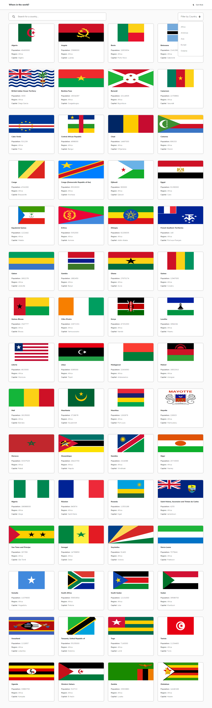

# Frontend Mentor - REST Countries API with color theme switcher solution

This is a solution to the [REST Countries API with color theme switcher challenge on Frontend Mentor](https://www.frontendmentor.io/challenges/rest-countries-api-with-color-theme-switcher-5cacc469fec04111f7b848ca). Frontend Mentor challenges help you improve your coding skills by building realistic projects.

### The challenge

Users should be able to:

- See all countries from the API on the homepage
- Search for a country using an `input` field
- Filter countries by region
- Click on a country to see more detailed information on a separate page
- Click through to the border countries on the detail page
- Toggle the color scheme between light and dark mode

### Screenshot

### Links

- Solution URL: [solution](https://github.com/ahmedmelfay/REST-Countries-API)

## My process

### Built with

- Semantic HTML5 markup
- SCSS
- Modern JS
- Flexbox
- Mobile-first workflow
- [React](https://reactjs.org/) - JS library

### What I learned

I learned how to manage 'global state' using React's Context API and useContext hook

### Useful resources

- (https://github.com/axios/axios) - Axios helped me for fetching the data from the API, its actually the first time to use axios I really liked this pattern and will use it going forward.
- (https://www.youtube.com/watch?v=4UZrsTqkcW4&t=34690s) - This is an amazing 'from zero to hero' React tutorial by the amazing John Smilga. I'd recommend it to anyone still learning react.

## Author

- Website - [Ahmed Elhoseny](https://github.com/ahmedmelfay)
- Frontend Mentor - [@ahmedmelfay](https://www.frontendmentor.io/profile/ahmedmelfay)
- LinkedIn - [@Ahmed Elghraz](https://www.linkedin.com/in/ahmed-elghraz-9790b41a9/)

## Acknowledgments

Everyone commented on these stackoverflow posts is an amazing person.

(https://stackoverflow.com/questions/67763498/why-do-i-need-cleanup-in-useeffect-in-react/67763602#67763602)
(https://stackoverflow.com/questions/67820126/my-code-doesnt-fetch-data-until-after-a-re-render/67820222#67820222)
